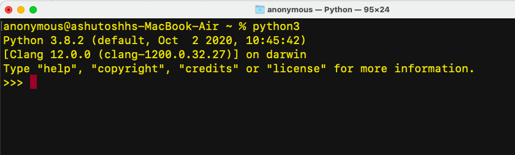

## This is about Pip 

### This task you can perform only when your pip or pip3 command is working 

<details>
 <summary>unlock</summary>
<p>

```bash
> Install a python module  named numpy using pip.
> Check list of all the modules installed using pip and store output in a file name delvexpythontask1.txt in Your Dekstop.
> Uninstal numpy using pip but before uninstalling check the version of numpy and store the output in the same file used in above steps.
> Commit this file in your git repo under pythontask branch.
> Also write steps for all the command you used to perform this task in your delvexpythontask1.txt file 

```

</p>
</details>

## THis is about python setup and installation checkup 

### Open  MAC terminal/ Windows powershell / Linux terminal as per your onw Operating system 

<details>
 <summary>unlock</summary>
<p>

```bash
> type python or python3 and take snapshot of the output and upoad it snapshot branch of your task.
> your output should be like this give below if not then please set your Environment variable PATH in your Operating system 


```


</p>
</details>

