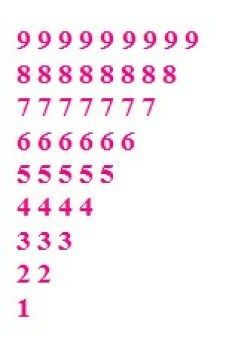

## This is about Basic python you need skill of decision making  and loops 

<marquee> Only Python 3 is accepted  </marquee>

### Take User input and process 

<details>
  <summary>Unlock</summary>
   <p>

```bash
> Take 5 integrer input from user.
> Remove all numbers less than 9.
> calculate the sum of remaining numbers.
> file name must be delvexsum.py in which you are writing code.
> commit this code on your github link under pythonbasic branch. 

```

</p>
</details>

### Take User input and decode logic  

<details>
  <summary>Unlock</summary>
   <p>

```bash
> Take 2 integrer input from user and print their products(their multiplication)
> IF product is greater than 500 then return their sum 
> If product is smaller than 500 then return "Hello Delvex code is running fine !!"
> file name must be delvexcal.py in which you are writing code.
> commit this code on your github link under pythonbasic branch. 

```

</p>
</details>

### Take User input in string form and perform operation 

<details>
<summary> Unlock </summary>

<p>

```bash
>  Take input from user in string form only and calucate the length of string.
>  IF length is greater than 7 then display only those character which are present in  even index number.
>  if length is less than or equals to 7 then display only those character which are present in odd index number.
> file name must be delvexstrindex.py in which you are writing code.
> commit this code on your github link under pythonbasic branch. 

```
</p>
</details>

### List operations and decoding  

<details>
<summary> Unlock </summary>

<p>

```bash
>  two list are give below L1 , L2.
>  create a new list called L3 containing items in below given  pattern.
>  From L1 it must take only odd index items.
>  From L2 it must take only even index items.
>  file name must be delvexlist.py in which you are going to write the code.
>  commit this code on your github link under pythonbasic branch. 

```
#### Input lists are 

```
L1=[11, 21, 24, 12, 18]
L2=[14, 44, 25, 37, 13]

```

### Expected output 

```
L3=[11,24,18,44,37]
```
</p>
</details>


###  Write programm to print below give pattern 

<details>
<summary> Unlock </summary>

<p>

```bash
>  file name must be pattern.py in which you are going to write the code.
>  commit this code on your github link under pythonbasic branch. 

```

#### Pattern is right here



</p>
</details>


